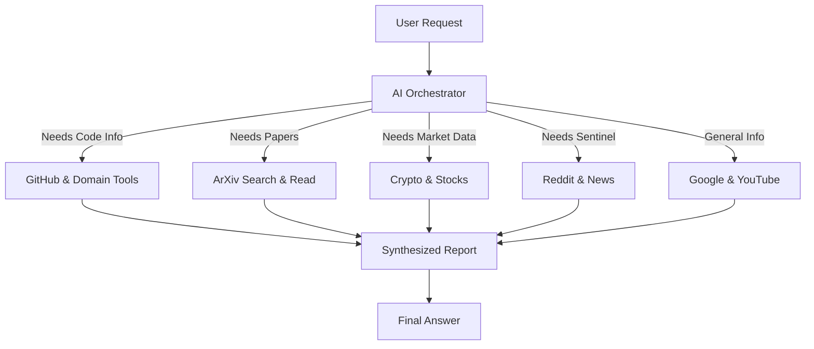

# 🧠 DeepResearch AI Agent

**A powerful, multi-modal research assistant powered by [Tambo AI](https://tambo.co).**

The DeepResearch Agent is designed to go beyond simple Q&A. It autonomously orchestrates specialized tools to conduct deep investigations into scientific papers, financial markets, code repositories, and social sentiment, synthesizing the data into comprehensive reports.

---

## 🚀 Key Capabilities

### 🔬 Scientific Research
- **Search ArXiv**: Find authentic academic papers and scientific studies.
- **Read PDFs**: Downloads and reads full paper PDFs to explain complex concepts, methodologies, and results.

### 💻 Tech & Code Intelligence
- **GitHub Analysis**: Analyzes repositories to understand code structure, dependencies, and project health.
- **Domain Intelligence**: Performs WHOIS and DNS lookups to verify website ownership, expiry, and server infrastructure.

### 📈 Financial Markets
- **Crypto Tracking**: Real-time Solana token prices and historical charts (via Jupiter API).
- **Stock Market**: Historical stock data for US tickers.
- **Crypto News**: Aggregates latest sentiment and news from CryptoPanic.

### 🌍 Global Knowledge
- **Web Search**: Google Search integration for real-time information.
- **Live News**: Fetches breaking news articles on any topic.
- **YouTube Intelligence**: Extracts and analyzes video transcripts.
- **Computational Knowledge**: Solves math and physics problems via WolframAlpha.

### 🗣️ Social Sentiment
- **Reddit Reviews**: Scrapes product reviews and discussions to gauge public opinion.
- **Deep Dive**: Reads full Reddit threads for detailed user feedback.

---

## 🛠️ Architecture

The agent uses a **Tool-Use Architecture** orchestrated by Tambo.



---

## ⚡ Getting Started

### 1. Clone the Repository
```bash
git clone https://github.com/yourusername/deepresearch-agent.git
cd deepresearch-agent
```

### 2. Install Dependencies
```bash
npm install
```

### 3. Environment Setup
Create a `.env.local` file in the root directory:

```env
# Tambo Configuration
NEXT_PUBLIC_TAMBO_API_KEY=your_tambo_api_key_here
NEXT_PUBLIC_TAMBO_URL=https://api.tambo.ai/v1

# Optional: Specific Tool Keys (if extending)
# OPENAI_API_KEY=...
```

### 4. Run Development Server
```bash
npm run dev
```
Open [http://localhost:3000](http://localhost:3000) to start researching!

---

## 🔧 Tools Reference

The agent is equipped with the following specialized tools (defined in `src/lib/tambo.ts`):

| Category | Tool Name | Description |
|----------|-----------|-------------|
| **Science** | `searchArxiv` | Search academic papers |
| **Science** | `readArxivPaper` | Read full PDF content |
| **Tech** | `analyzeGithubRepo` | Analyze GitHub repo structure & stats |
| **Tech** | `analyzeDomain` | WHOIS & DNS lookup |
| **Finance** | `getCryptoPrice` | Real-time token price (Solana) |
| **Finance** | `getCryptoHistory` | Historical chart data |
| **Finance** | `getStockHistory` | US Stock market data |
| **Social** | `searchRedditReviews` | Find Reddit discussions |
| **Social** | `getRedditThread` | Scrape full thread comments |
| **Utility** | `generatePdf` | Create downloadable reports |
| **Utility** | `wolframCalculation` | Math & Physics solver |
| **Utility** | `getYoutubeTranscript` | Video text extraction |

---

## 🎨 Tech Stack

- **Framework**: [Next.js 14](https://nextjs.org/) (App Router)
- **AI Framework**: [Tambo AI](https://tambo.co)
- **Styling**: [Tailwind CSS](https://tailwindcss.com/)
- **UI Components**: Radix UI, Lucide Icons
- **Graphs**: Recharts

---

*Built with ❤️ using Tambo AI*
